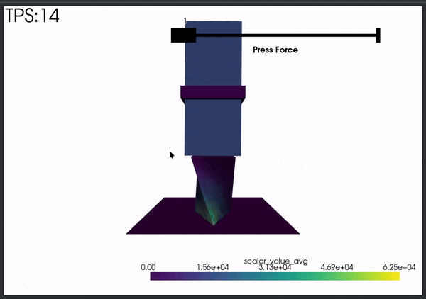

# Hydraulic Press Simulation Project
This repository contains my semestral project in Computer Graphics about simulating non-rigid bodies inside a hydraulic press.
The project uses Blender and a custom blender add-on to generate the simulation, it uses PolyFEM to run the simulation, and it visualizes every step of it using PyVista.



## Prerequisites
### Required:
polyfempy(the Python bindings for PolyFEM) and pyvista(visualization library) are the only strict requirements to be installed
To generate the configuration and mesh, this project uses Blender, our custom blender add-on, and FTetWild(to convert to tet mesh and optimize it)
The configuration and mesh can be provided in other ways, not covered in this README.
## Usage
### Configuration and mesh generation:
A simulation configuration file must be generated/provided, along with the matching mesh to press.
To generate a file and mesh, the custom Blender add-on I have written can be used.
FTetWild is also required for this process, the add-on expects the executable FloatTetWild_bin to be found in the PATH

To install the add-on:
open Blender->Edit->Preferences->Add-ons->Arrow Menu->Install From Disk...->blender_addon.py(from the repository directory)

To generate a set of configuration and mesh:
Open any blender mesh->File->Export->Export to PolyFEM
Set the desired E, nu and rho parameters of the mesh.
Export the mesh to the repository directory(or copy the configuration and mesh into it later).

### Simulation
To run the simulation, execute the simulation python script:
```bash
python ./simulation.py ./export_test.json 
```
The simulation will start running and show each step generated

## Simulation GUI
The top left of the simulation shows the current Ticks Per Second(TPS), the amount of steps being simulated each second, the system is trying to run at 24 TPS.
The top right of the simulation shows the press force slider that can be adjusted at any time, the max force of the slide can be adjusted with an optional parameter(default=10000):
```bash
python ./simulation.py ./export_test.json 50000
```
The simulation itself can be rotated freely.

## Work Log
A log containing progress, failed avenues, and other less relevant information in the [work log](work_log.md)
