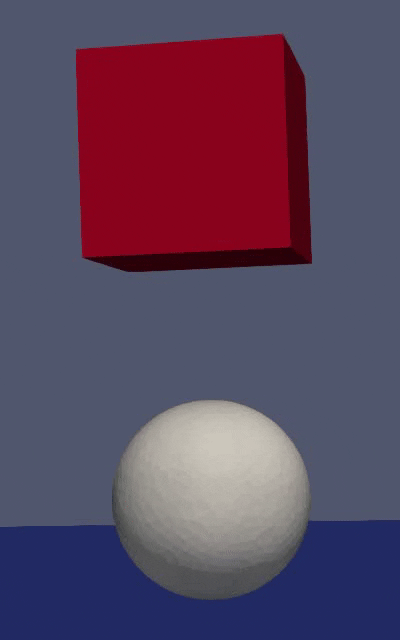

# Work Log
This is a log of the steps and progress made while working on this project.

## Library Exploration
Before the start of the project, I tested out the [IPC Library](https://github.com/ipc-sim/IPC) for simulating non-rigid bodies, and then proceeded to the more up-to-date [PolyFEM library](https://polyfem.github.io/)
The simulation with IPC was both slower and more complicated to configure.
Both libraries were complicated to build and required fixing up various compilation flags and getting the correct compiler version, additionally, for PolyFEM, some dependency files needed manual changes to compile.
After getting the CPP codebase of PolyFEM running and getting familiar with configuring it, I learned that it is difficult to modify its behaviour to work with it in realtime(instead of just running the simulation to the end and visualising in another program, like paraview)
So the next step was getting the python bindings for PolyFEM working.
PolyFEM provides a few methods to install the python bindings:
- Via pip from PyPI
- Via pip from the repository
- Via conda
Additionally, PolyFEM documentations offer 2 methods of outputting results:
- Output files in the same format as the CPP codebase, compatible with a viewer like paraview.
- Jupyter
After trying all options, I managed to get the repository version running with the output files format.
PyPI and conda both had various installation problems and Jupyter only outputted JavaScript errors when trying to show the simulation output.

## Adjusting the simulation approach
First an animation based version was created, meaning the top plate is scripted to move down at a specific rate.

This version has 2 main issues:
- The simulation is very slow, 6-7 minutes for a 50 step simulation(0.02s steps)
- The only control we have is the rate of approach, the plate always behaves as an "immovable objects" and the mesh *must* conform to the it.

Next I addressed these issues:
### Performance:
There are a few methods of increasing the simulation performance within the library:
- Using lower quality models
  I optimized all the meshes I used using FTetWild, some experimentation was needed to find the right parameters for this project(the parameters used for the final version are --coarsen -l 1 --use-floodfill --stop-energy 100).
  The specific model being pressed is irrelevant, this stage was about finding out how complex I can make it while simulating in real time.
- Using Less steps(at higher time steps)
  Not applicable to a continuous realtime simulation
- Using a faster solver
  I experimented with all the available solvers, and the default solvers were generally the fastest, but I adjusted their stop threshold to significantly reduce the time per step at the cost of simulation accuracy, which did not cause any visible issues in the simulation.
  The exact list of solvers was hard to find because the python version is not up-to-date with the documentations, even in the repository version)
The simulation after this step(also includes the force application from the next section):

### Force-based instead of Animation-based simulation:
I replaced the simulation approach to use a force applied to the top of the top part of the press, which is more accurate to how a real hydraulic press works.
I also created new meshes for the top part and a holder to stabilize and hold it in the same place(which it could slip out of otherwise when not using an animation based simulation)
The simulation after this step:

## Real-time Visualisation
All the videos so far were generated by running the simulation to it's end, opening the output step files in Paraview and generating a video out of them.
One of the goals of this project is to provide a real-time Visualisation for these simulations.
I've built a simple Python program that runs and shows each step while the simulation is running in a background thread.
The program allows the user to modify the force applied via the press, rotate the scene and see the current Ticks Per Seconds(TPS, amount of steps simulated each second).
The program tries to run at 24 TPS.

## Configuration generation
To make it easier to create the configuration for a hydraulic press simulation, I wrote a Blender add-on the exports any mesh into an optimized tet mesh and generates a matching simulation configuration for it.

Then, to allow any size of mesh, I made the size of everything else in the simulation configuration match the bounding box of the mesh, which prevents simulation crashes due to intersections and enforces that the press always covers the pressed mesh.

# Final Output
After all of these steps, this is what the simulation looks like running:
[final.webm](https://github.com/user-attachments/assets/99ddcd5b-8585-452f-8682-058555cabb40)
